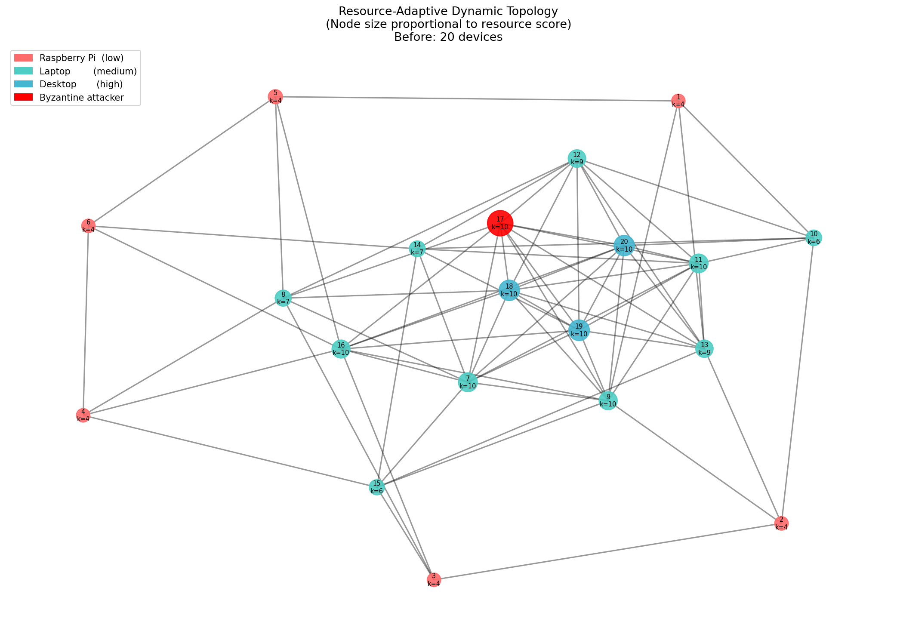

# Gossip-Based Federated Learning with Byzantine Tolerance

A decentralized, privacy-preserving Federated Learning system that combines:

- **Resource-Adaptive Dynamic Topology** — each device gets a personalized neighbor count based on its hardware capabilities
- **Gossip Protocol** — decentralized model exchange without a central server
- **Differential Privacy** — gradient noise injection before sharing
- **DCT Compression** — reduces communication cost
- **Byzantine Detection** — cosine similarity + IQR-based outlier filtering

---

## Project Structure

```
gossip_fl/
├── device.py           # EdgeDevice class, resource profiling, dynamic k
├── topology.py         # Topology construction, saturation handling, add_device()
├── data_loader.py      # MNIST loading, IID and Non-IID distribution
├── grad_compression.py # DCT-based gradient compression                 [Phase 2]
├── privacy.py          # Differential privacy (Gaussian noise)          [Phase 3]
├── gossip.py           # Gossip exchange                                 [Phase 4]
├── byzantine.py        # Quality assessment & Byzantine detection        [Phase 5]
├── aggregation.py      # Weighted aggregation & model update             [Phase 6]
└── main.py             # Full training loop, 200 rounds
```

---

## System Overview

### Network Configuration

| Parameter           | Value                              |
| ------------------- | ---------------------------------- |
| Total devices (N)   | 20                                 |
| Byzantine devices   | 1 (Device 17)                      |
| Training rounds (T) | 200                                |
| Dataset             | MNIST (60,000 train / 10,000 test) |
| Model               | 4-layer CNN (421,642 parameters)   |
| Batch size          | 64                                 |
| Base learning rate  | 0.01 (SGD + momentum=0.9)          |
| LR decay            | ×0.95 every 50 rounds              |

### Device Distribution

| Device Type        | Count | IDs   | R range   | k range |
| ------------------ | ----- | ----- | --------- | ------- |
| Raspberry Pi (low) | 6     | 1–6   | 0.14–0.28 | 3–4     |
| Laptop (medium)    | 10    | 7–16  | 0.46–1.27 | 6–10    |
| Desktop (high)     | 4     | 17–20 | 1.61–3.07 | 10      |

---

## Installation

```bash
pip install torch torchvision numpy networkx matplotlib scipy
```

---

## Usage

```bash
python main.py
```

---

## Core Algorithms

### Resource Score (Paper Eq. 1–4)

```
R(i) = 0.4 × (cores × freq / 10)
     + 0.4 × (RAM_GB / 32)
     + 0.2 × (bandwidth_Mbps / 100)
```

### Dynamic Neighbor Count (Paper Eq. 5)

```
k(i) = clip( k_min + floor(R(i) × (k_max − k_min)), k_min, k_max )
```

where k_min = 3 and k_max = 10.

### Topology Construction

1. Sort devices by R(i) descending
2. Greedily assign neighbors (highest unmet demand first)
3. Handle saturation via capacity relaxation
4. Guarantee connectivity with DFS bridge-edge insertion

### Data Preprocessing (Paper Section III-C)

- Pixel values scaled to range [0, 1]
- Reshaped into 4D format [N, 1, 28, 28] for CNN input
- Training set distributed proportionately across all devices

---

## Key Design Decisions

**Why varied specs within the same device type?**
Real-world devices of the same category (e.g., laptops) differ in CPU speed, RAM, and bandwidth. Using fixed specs for all laptops would make k identical — defeating the purpose of dynamic assignment.

**Why seed = device_id?**
Using the device ID as the random seed ensures reproducible results across runs. The same device always gets the same hardware specs, making experiments comparable.

**Why is Device 17 Byzantine?**
Device 17 is the highest-resource desktop, making it a worst-case attacker — it has the most neighbors and the most influence on the network.

**Why IID for main experiment?**
The base paper distributes data proportionately across clients without specifying Non-IID. IID is the closest match and provides a fair baseline. Non-IID is included for ablation studies.

---

## References

1. Hidayat, M. A., Nakamura, Y., & Arakawa, Y. (2024). _Privacy-Preserving Federated Learning With Resource-Adaptive Compression for Edge Devices._ IEEE Internet of Things Journal, 11(8).
2. Koloskova, A., et al. (2020). _Decentralized Stochastic Optimization and Gossip Algorithms with Compressed Communication._ ICML.
3. McMahan, B., et al. (2017). _Communication-Efficient Learning of Deep Networks from Decentralized Data._ AISTATS.

---

## Status

| Phase | Module                          | Status                                                     |
| ----- | ------------------------------- | ---------------------------------------------------------- |
| 1     | device.py, topology.py          | ✅ Complete                                                |
| 2     | data_loader.py                  | ✅ Complete                                                |
| 3     | grad_compression.py, privacy.py | ✅ Complete                                                |
| 4     | gossip.py                       | ✅ Complete                                                |
| 5     | byzantine.py                    | ⚠️ Complete — Byzantine detection issue present, needs fix |
| 6     | aggregation.py, main.py         | ✅ Complete                                                |



